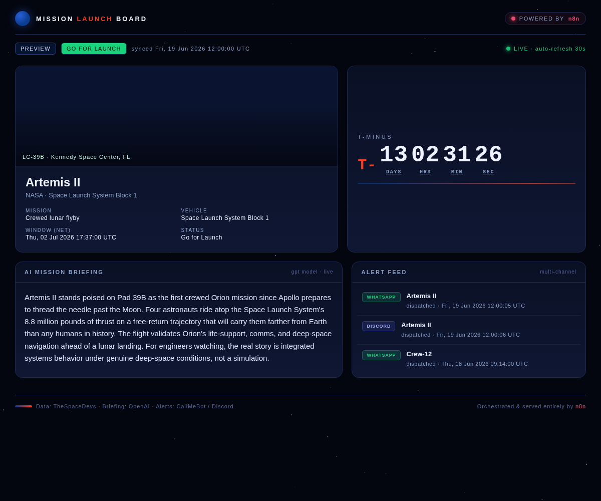

# NASA Mission Launch Board - n8n Meetup Demo

Kickoff event: **July 23 at BWTech South**

This repo contains a ready-to-import n8n workflow for a live launch-tracking demo. It pulls launch data from TheSpaceDevs, asks OpenAI for a short mission briefing, optionally sends alerts, and serves a live Launch Board website from n8n.



## One-click downloads

- [Download the n8n workflow JSON](https://raw.githubusercontent.com/gmossy/n8n-meetup/main/launch_tracker_workflow.json)
- [Download this repo as a ZIP](https://github.com/gmossy/n8n-meetup/archive/refs/heads/main.zip)
- [Open the GitHub repo](https://github.com/gmossy/n8n-meetup)

To import the workflow: download `launch_tracker_workflow.json`, then in n8n go to **Workflows -> Import from File**.

## What is n8n?

n8n is an open-source workflow automation platform. Think of it as a visual way to connect APIs, databases, AI models, webhooks, schedules, and business tools without writing a full backend service from scratch.

In n8n, each workflow is made of nodes. A node can fetch data from an API, transform JSON, call an AI model, branch based on a condition, send a message, or respond to a webhook. You can run workflows manually, on a schedule, or when an external app calls a webhook.

This demo uses n8n as both:

- an automation engine that fetches launch data and creates an AI briefing
- a tiny web server that serves the Launch Board page from a webhook

That is the useful idea for the meetup: n8n can orchestrate real backend work and expose a simple live app without needing a separate server.

## What the workflow does

The workflow has two paths:

- **Schedule path:** fetches upcoming and previous launches from TheSpaceDevs, decides whether the board should show a preview or recap, calls OpenAI for a short mission briefing, saves the latest state, and optionally fans out alerts to WhatsApp and Discord.
- **Webhook path:** serves the Launch Board website at `/webhook/launch-board`. The same URL with `?format=json` returns the board data as JSON.

The Launch Board includes a selectable **Previous Launches** list. Run the workflow once from **Schedule Trigger** to populate that list.

## Protect your OpenAI key

If you have ever pasted an OpenAI key into chat, a screenshot, a workflow JSON file, or a public page, treat it as exposed and rotate it.

Do this first:

1. Go to the OpenAI API keys page.
2. Revoke the exposed key.
3. Create a new key.
4. Store the new key only in your n8n environment or credential store.

Do **not** put real API keys in:

- GitHub repos
- n8n workflow JSON exports
- README files
- screenshots
- frontend JavaScript
- webhook URLs

This workflow uses an environment variable reference instead of a hardcoded key:

```text
Bearer {{ $env.OPENAI_API_KEY }}
```

For self-hosted n8n, set:

```bash
OPENAI_API_KEY=your_new_key_here
```

For Docker Compose, add it to the n8n service environment:

```yaml
environment:
  - OPENAI_API_KEY=${OPENAI_API_KEY}
```

For n8n Cloud or other hosted setups, use n8n credentials or variables and update the OpenAI HTTP Request header to reference the secret from that store.

## Setup

1. Download `launch_tracker_workflow.json`.
2. Import it into n8n.
3. Set `OPENAI_API_KEY` in your n8n environment.
4. Open the **Config** node and update optional settings:
   - `callmebot.enabled`
   - `callmebot.phone`
   - `callmebot.apikey`
   - `discord.enabled`
   - `discord.webhookUrl`
5. Activate the workflow.
6. In the editor, use the bottom dropdown and select **from Schedule Trigger**.
7. Click **Execute workflow** once to populate the board.
8. Open your board:

```text
https://<your-n8n-host>/webhook/launch-board
```

JSON data is available at:

```text
https://<your-n8n-host>/webhook/launch-board?format=json
```

## Files

- `launch_tracker_workflow.json` - importable n8n workflow
- `launch-board.html` - standalone copy of the Launch Board page
- `preview.png` - screenshot for the repo
- `.env.example` - local environment example, without secrets

## Demo tips

- For a live demo, show the n8n canvas on one screen and the Launch Board on another.
- Run **from Schedule Trigger**, not **from Webhook (Launch Board)**, when you want to refresh launch data.
- Use `forceMode: 'recap'` in the Config node if you want to force the recap branch on stage.
- TheSpaceDevs free API is rate limited, so avoid rapid repeated runs.

## Hosting the HTML separately

The recommended path is to let n8n serve the page from the webhook. If you host `launch-board.html` somewhere else, edit the `API_URL` constant in the script and set it to your full n8n webhook URL.

Example:

```js
var API_URL = "https://your-n8n.example.com/webhook/launch-board";
```

The workflow's JSON response includes CORS headers so a separately hosted page can poll the n8n webhook.
