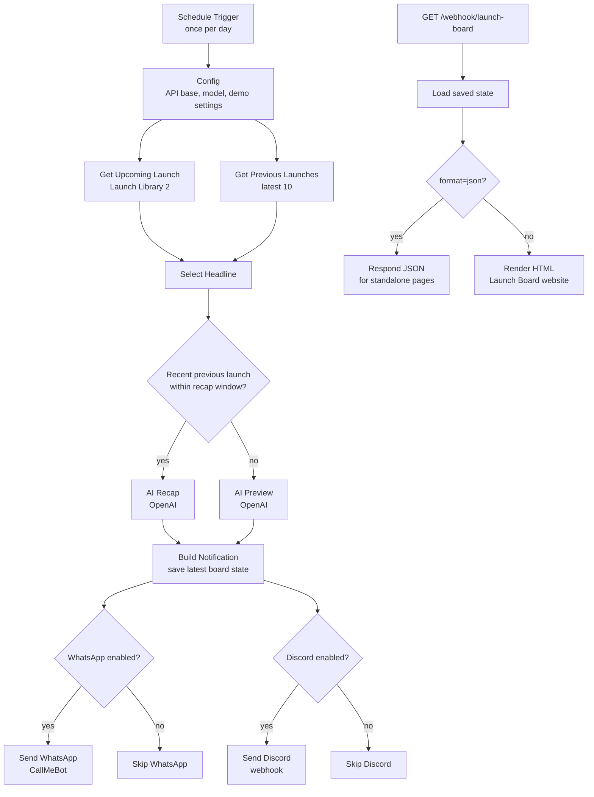

# NASA Mission Launch Board - n8n Meetup Demo

Kickoff event: **July 23 at BWTech South**

This repo contains a ready-to-import n8n workflow for a live launch-tracking demo. It pulls launch data from TheSpaceDevs, asks OpenAI for a short mission briefing, optionally sends alerts, and serves a live Launch Board website from n8n.


## One-click downloads

- [Open the Intro to n8n onboarding page](https://gmossy.github.io/n8n-meetup/intro-to-n8n/)
- [Open the Intro to n8n guide](intro-to-n8n/README.md)
- [Download the beginner Daily Top AI Headline workflow](intro-to-n8n/daily_top_ai_headline_workflow.json)
- [Open the Intro to n8n AI page](https://gmossy.github.io/n8n-meetup/intro-to-n8n-ai/)
- [Download the advanced AI News Briefing workflow](intro-to-n8n-ai/ai_news_briefing_workflow.json)
- [Download the n8n workflow JSON](https://raw.githubusercontent.com/gmossy/n8n-meetup/main/launch_tracker_workflow.json)
- [Download this repo as a ZIP](https://github.com/gmossy/n8n-meetup/archive/refs/heads/main.zip)
- [Open the GitHub Pages landing page](https://gmossy.github.io/n8n-meetup/)
- [Open the GitHub repo](https://github.com/gmossy/n8n-meetup)

To import the workflow: download `launch_tracker_workflow.json`, then in n8n go to **Workflows -> Import from File**.

## What is n8n?

n8n is an open-source workflow automation platform. Think of it as a visual way to connect APIs, databases, AI models, webhooks, schedules, and business tools without writing a full backend service from scratch.

In n8n, each workflow is made of nodes. A node can fetch data from an API, transform JSON, call an AI model, branch based on a condition, send a message, or respond to a webhook. You can run workflows manually, on a schedule, or when an external app calls a webhook.

This demo uses n8n as both:

- an automation engine that fetches launch data and creates an AI briefing
- a tiny web server that serves the Launch Board page from a webhook

That is the useful idea for the meetup: n8n can orchestrate real backend work and expose a simple live app without needing a separate server.

## Hosting options: local Docker or cloud VPS

This project is currently demoed from Glenn's Hostinger account. The Hostinger **VPS** hosts the n8n instance, and n8n serves the Launch Board from this webhook URL:

```text
https://n8n.srv1189229.hstgr.cloud/webhook/launch-board
```

[Hostinger](https://www.hostinger.com/) is a web hosting provider. In this project, Hostinger provides the cloud server, the VPS runs n8n, and n8n runs the workflow plus the public webhook. That setup keeps the Launch Board online even when a local laptop is closed.

The hosting term is **VPS**, short for **Virtual Private Server**. A VPS is a virtual server rented from a hosting provider. It runs on a larger physical machine, but your VPS gets its own allocated CPU, memory, storage, operating system, and server configuration. For developers, it feels like a small Linux server in the cloud: you can SSH into it, install Docker, run n8n, attach a domain, and keep workflows online 24/7.

For this repo, you have two good ways to run the demo:

- **Local Docker:** best for meetup attendees, learning, hacking, and safe experimentation. Run n8n on your own computer with Docker, import the workflow, and open `http://localhost:5678/webhook/launch-board`.
- **Cloud VPS:** best for a public or always-on demo. Run n8n on a VPS provider such as Hostinger, keep secrets in the server environment, activate the workflow, and share the production webhook URL.

The workflow file is the same in both cases. The difference is where n8n runs: on your laptop for local development, or on a cloud VPS for a persistent public instance.

## What the workflow does

The workflow has two paths:

- **Schedule path:** fetches upcoming and previous launches from TheSpaceDevs, decides whether the board should show a preview or recap, calls OpenAI for a short mission briefing, saves the latest state, and optionally fans out alerts to WhatsApp and Discord.
- **Webhook path:** serves the Launch Board website at `/webhook/launch-board`. The same URL with `?format=json` returns the board data as JSON.

The Launch Board includes a selectable **Previous Launches** list. The workflow refreshes automatically once per day when active. Run the workflow once from **Schedule Trigger** to populate the list immediately.

## How the launch data API works

The workflow uses [TheSpaceDevs Launch Library 2](https://thespacedevs.com/llapi), a public spaceflight data API. TheSpaceDevs describes Launch Library 2 as a database of rocket launches, space events, crewed spaceflight, agencies, pads, vehicles, and related mission data. The public tier is free for light use and is rate limited, so this demo only refreshes once per day by default.

The workflow calls two unauthenticated HTTP endpoints:

```text
https://ll.thespacedevs.com/2.2.0/launch/upcoming/?limit=1&mode=detailed&hide_recent_previous=true
https://ll.thespacedevs.com/2.2.0/launch/previous/?limit=10&mode=detailed
```

The first request fetches the next upcoming launch. The second request fetches the latest previous launches for the selectable history list. `mode=detailed` asks the API for richer launch objects, including provider, rocket, mission, pad, location, image, status, webcast, and launch time fields.

No API key is needed for TheSpaceDevs in this demo. The paid/Patreon path is only needed if you want higher request rates. For meetup use, the once-per-day schedule plus occasional manual test runs should stay comfortably small.

## Workflow map



## Workflow brief

The scheduled side of the workflow is the data refresh. It wakes up once per day, calls Launch Library 2 for the next launch and the latest previous launches, normalizes the API response into a smaller shape, and chooses the board mode:

- **Preview mode:** show the next upcoming mission.
- **Recap mode:** if the latest previous launch happened within the configured recap window, show that launch instead.

After choosing the launch, the workflow sends a compact mission prompt to OpenAI. OpenAI returns a short engineer-friendly preview or recap. The workflow stores that briefing, the selected launch, the previous-launch list, and recent notification history in n8n workflow static data.

The webhook side is the website. When someone opens `/webhook/launch-board`, n8n loads the saved static data and returns the Launch Board HTML. When the page asks for `/webhook/launch-board?format=json`, n8n returns the same state as JSON with CORS enabled, so the board can also be hosted separately on GitHub Pages if desired.

## Protect your OpenAI key

If you have ever pasted an OpenAI key into chat, a screenshot, a workflow JSON file, or a public page, treat it as exposed and rotate it.

Do this first:

1. Go to the OpenAI API keys page.
2. Revoke the exposed key.
3. Create a new key.
4. Store the new key only in your n8n environment or credential store.

Do **not** put real API keys in:

- GitHub repos
- n8n workflow JSON exports
- README files
- screenshots
- frontend JavaScript
- webhook URLs

This workflow uses an environment variable reference instead of a hardcoded key:

```text
Bearer {{ $env.OPENAI_API_KEY }}
```

For self-hosted n8n, set:

```bash
OPENAI_API_KEY=your_new_key_here
```

For Docker Compose, add it to the n8n service environment:

```yaml
environment:
  - OPENAI_API_KEY=${OPENAI_API_KEY}
```

For n8n Cloud or other hosted setups, use n8n credentials or variables and update the OpenAI HTTP Request header to reference the secret from that store.

## Quickstart with your own n8n Docker

Developers at the meetup should run their own local n8n instance. The Launch Board website is served by n8n, so you do not need a separate web server for the demo.

Prerequisites:

- Docker Desktop
- an OpenAI API key
- this repo ZIP or a cloned copy of the repo

1. Copy the environment example:

```bash
cp .env.example .env
```

2. Edit `.env` and put in your own OpenAI key:

```bash
OPENAI_API_KEY=your_new_key_here
CALLMEBOT_PHONE=+15551234567
CALLMEBOT_APIKEY=your_callmebot_key_here
```

3. Start n8n with Docker:

```bash
docker run --rm -it \
  --name n8n-launch-board \
  -p 5678:5678 \
  --env-file .env \
  -v n8n_launch_board_data:/home/node/.n8n \
  docker.n8n.io/n8nio/n8n
```

4. Open n8n:

```text
http://localhost:5678
```

5. Create the local n8n owner account if this is your first run.

6. Import the workflow:

```text
Workflows -> Import from File -> launch_tracker_workflow.json
```

7. Open the imported workflow and activate it.

8. Populate the Launch Board:

```text
Bottom Execute workflow dropdown -> from Schedule Trigger -> Execute workflow
```

Use **from Schedule Trigger** when you want to fetch launch data immediately. Use **from Webhook (Launch Board)** only when testing the website trigger.

9. Open the local website:

```text
http://localhost:5678/webhook/launch-board
```

10. Optional: inspect the JSON powering the page:

```text
http://localhost:5678/webhook/launch-board?format=json
```

To stop n8n, press `Ctrl+C` in the Docker terminal. Your workflow data stays in the Docker volume named `n8n_launch_board_data`.

## WhatsApp delivery

The WhatsApp alert is sent by the **Send WhatsApp** node through CallMeBot:

```text
https://api.callmebot.com/whatsapp.php
```

It sends to the phone number in your n8n environment variable:

```bash
CALLMEBOT_PHONE=+15551234567
```

The CallMeBot API key is read from:

```bash
CALLMEBOT_APIKEY=your_callmebot_key_here
```

For your own local `.env`, use the phone number that CallMeBot activated for you and the API key CallMeBot gave you. Do not commit `.env`; it is ignored by `.gitignore`.

## Setup

1. Download `launch_tracker_workflow.json`.
2. Import it into n8n.
3. Set `OPENAI_API_KEY` in your n8n environment.
4. Open the **Config** node and update optional settings:
   - `callmebot.enabled`
   - `discord.enabled`
   - `discord.webhookUrl`
5. Activate the workflow.
6. In the editor, use the bottom dropdown and select **from Schedule Trigger**.
7. Click **Execute workflow** once to populate the board.
8. Open your board:

```text
https://<your-n8n-host>/webhook/launch-board
```

JSON data is available at:

```text
https://<your-n8n-host>/webhook/launch-board?format=json
```

## Files

- `launch_tracker_workflow.json` - importable n8n workflow
- `launch-board.html` - standalone copy of the Launch Board page
- `preview.png` - screenshot for the repo
- `.env.example` - local environment example, without secrets

## Demo tips

- For a live demo, show the n8n canvas on one screen and the Launch Board on another.
- The active workflow refreshes automatically once per day. Run **from Schedule Trigger**, not **from Webhook (Launch Board)**, when you want to refresh launch data manually.
- Use `forceMode: 'recap'` in the Config node if you want to force the recap branch on stage.
- TheSpaceDevs free API is rate limited, so avoid rapid repeated runs.

## Hosting the HTML separately

The recommended path is to let n8n serve the page from the webhook. If you host `launch-board.html` somewhere else, edit the `API_URL` constant in the script and set it to your full n8n webhook URL.

Example:

```js
var API_URL = "https://your-n8n.example.com/webhook/launch-board";
```

The workflow's JSON response includes CORS headers so a separately hosted page can poll the n8n webhook.
